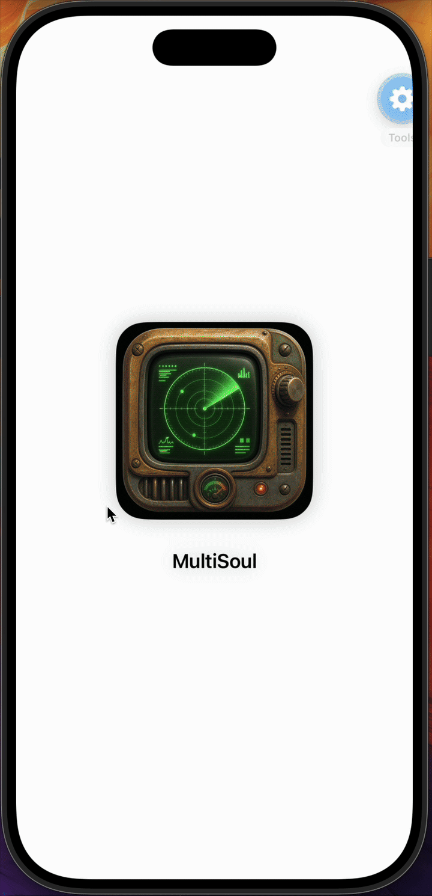
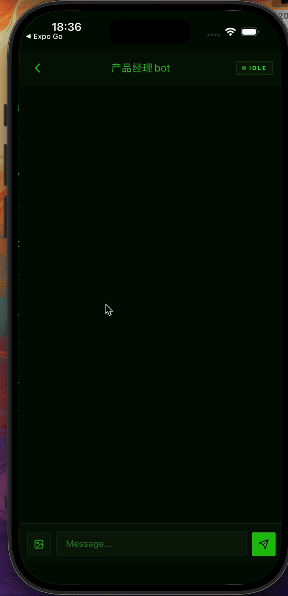

<p align="center">
  <h1 align="center">MultiSoul</h1>
  <p align="center">A mobile console for local AI agents.</p>
  <p align="center">
    <a href="ARCHITECTURE.md">Architecture</a>
    ·
    <a href="docs/product-specs/">Product Specs</a>
    ·
    <a href="docs/runbooks/cli-release.md">CLI Release</a>
  </p>
  <p align="center">
    <a href="https://github.com/yakami129/multisoul/stargazers">
      
    </a>
  </p>
  <p align="center">
    English | <a href="README.zh-CN.md">中文</a>
  </p>
</p>

<p align="center">
  
  
</p>

---

MultiSoul lets you control AI agents running on your own computer from your phone. You can watch messages and tool calls in real time, answer approval questions, and receive task completion notifications.

There is no central MultiSoul backend. `msctl` runs locally, stores data locally, and exposes an endpoint that your phone connects to through Tailscale.

## What You Can Do

- Control Claude Code, Codex, or Cursor Agent CLI from a phone
- Watch agent messages, tool calls, tool results, and task status
- Answer `AskUserQuestion` prompts in the mobile app
- Keep an Inbox for pending questions and completed/failed tasks
- Connect one phone to multiple computers through Tailscale
- Run the service in the foreground or as a background daemon

## How It Works

```
Mobile App (React Native + Expo)
        │ Tailscale / HTTPS / WSS + Bearer token
        ▼
msctl serve (Rust, local machine)
        ├── Runtime adapters: Claude Code / Codex / Cursor Agent CLI
        ├── REST + WebSocket
        └── SQLite: ~/.config/msctl/serve.db
```

## Requirements

- Node.js 18+
- Tailscale on both your computer and phone
- One agent runtime installed on your computer:
  - Claude Code: `claude`
  - Codex CLI: `codex`
  - Cursor Agent CLI: `agent`
- Rust toolchain, only if you run `msctl` from source

## Install Tailscale

Install Tailscale on your computer and phone, then sign in to the same Tailnet.

Official guide: [tailscale.com/docs/install](https://tailscale.com/docs/install)

Common setup:

```bash
# macOS
# Install from https://tailscale.com/download/mac

# Linux
curl -fsSL https://tailscale.com/install.sh | sh
sudo tailscale up

# Verify
tailscale status
tailscale ip
```

On iOS or Android, install Tailscale from the app store and sign in with the same account.

Tailnet access is the default and recommended private setup. If you need a public HTTPS URL, enable Tailscale Funnel and start the service with `msctl serve --funnel`. See [Tailscale Funnel docs](https://tailscale.com/docs/features/tailscale-funnel).

## Quick Start

### 1. Install `msctl`

```bash
npm install -g @yakami129/msctl
```

Or run it from source:

```bash
cd cli
cargo run -- --help
```

### 2. Start the Agent service

Fastest installed CLI flow:

```bash
msctl daemon quickstart --token test --port 8765 --tailnet true
```

From source:

```bash
cd cli
cargo run -- daemon quickstart --token test --port 8765 --tailnet true
```

This command saves the token, installs and starts the background service, binds it for Tailnet access, and prints a QR code.

In the mobile app, open:

```text
Settings -> Add Endpoint -> Scan QR
```

Scan the QR code to register this computer as a MultiSoul endpoint on your phone.

For real personal use, replace `test` with your own long token.

Useful daemon commands:

```bash
msctl daemon status
msctl daemon logs -f
msctl daemon restart
msctl daemon stop
```

Foreground mode:

```bash
msctl serve --tailnet --port 8765 --token test
```

### 3. Register an Agent

Codex:

```bash
msctl agent register \
  --name work-codex \
  --project /path/to/project \
  --runtime codex \
  --mode full-auto
```

Claude Code:

```bash
msctl agent register \
  --name work-claude \
  --project /path/to/project \
  --runtime claude-code
```

Cursor Agent CLI:

```bash
msctl agent register \
  --name work-cursor \
  --project /path/to/project \
  --runtime cursor-cli \
  --mode ask
```

Check registered agents:

```bash
msctl agent list
```

### 4. Run the mobile app locally

```bash
cd mobile
pnpm install
pnpm start
```

Native simulators:

```bash
pnpm ios
pnpm android
```

## Development

CLI:

```bash
cd cli
cargo build
cargo test
cargo run -- serve
```

Mobile:

```bash
cd mobile
pnpm install
pnpm typecheck
pnpm test -- --watchAll=false
pnpm start
```

## Local Data

| Path | Purpose |
|------|---------|
| `~/.config/msctl/serve.db` | Agents, conversations, messages, tasks, push tokens |
| `~/.config/msctl/config.toml` | Local `msctl` config |
| `~/.config/msctl/uploads/` | Uploaded images |
| Mobile local storage | Endpoints, tokens, Inbox cache |

## Documentation

- [ARCHITECTURE.md](ARCHITECTURE.md): system architecture
- [docs/product-specs/](docs/product-specs/): product specs
- [docs/design-docs/](docs/design-docs/): design notes
- [docs/runbooks/cli-release.md](docs/runbooks/cli-release.md): CLI release
- [mobile/docs/ios-publish.md](mobile/docs/ios-publish.md): iOS release
