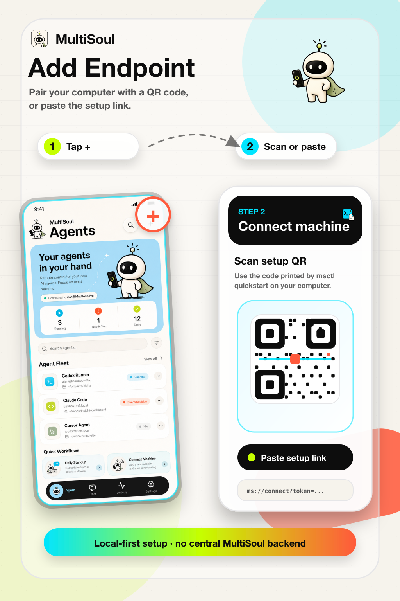

<p align="center">
  <h1 align="center">MultiSoul</h1>
  <p align="center">本地 AI Agent 的手机控制台。</p>
  <p align="center">
    <a href="ARCHITECTURE.md">系统架构</a>
    ·
    <a href="docs/product-specs/">产品规格</a>
    ·
    <a href="docs/runbooks/cli-release.md">CLI 发布</a>
  </p>
  <p align="center">
    <a href="https://github.com/yakami129/multisoul/stargazers">
      
    </a>
  </p>
  <p align="center">
    <a href="README.md">English</a> | 中文
  </p>
</p>

<p align="center">
  
</p>

---

MultiSoul 是一个个人 AI Agent 手机控制台。你可以用手机连接自己电脑上运行的 AI Agent，实时查看消息和工具调用，回复审批/选择问题，并接收任务完成通知。

MultiSoul 没有中心后端。`msctl` 运行在你的电脑上，数据保存在本机，手机通过 HTTPS 连接。默认使用公网 relay 隧道，**无需 VPN**。

## 可以做什么

- 在手机上控制 Claude Code、Codex 或 Cursor Agent CLI
- 实时查看 Agent 消息、工具调用、工具结果和任务状态
- 在 App 内回复 `AskUserQuestion` 决策问题
- 用 Inbox 汇总待回复问题和任务完成/失败通知
- 一台手机连接多台电脑
- 支持前台运行，也支持后台 daemon 常驻

## 工作方式

```
手机 App (React Native + Expo)
        │ HTTPS / WSS + Bearer token
        ▼
msctl serve (Rust，本机服务)
        ├── Relay（默认）：Cloudflare Tunnel → 公网 HTTPS
        ├── Tailscale / Funnel（可选）：Tailnet 私有或公网地址
        ├── Runtime adapters: Claude Code / Codex / Cursor Agent CLI
        ├── REST + WebSocket
        └── SQLite: ~/.config/msctl/serve.db
```

## 依赖

- Node.js 18+
- 电脑上至少安装一个 Agent runtime：
  - Claude Code: `claude`
  - Codex CLI: `codex`
  - Cursor Agent CLI: `agent`

## 快速开始

### 1. 安装 `msctl`

```bash
npm install -g @yakami129/msctl
```

### 2. 启动服务

```bash
msctl daemon quickstart
```

自动生成 token、安装后台 daemon、打开公网 relay 隧道并打印二维码。在 App 中扫描（**Agents → + → Scan QR**），或点击 **Paste connection string** 粘贴二维码旁的连接串。首次运行可能因下载 cloudflared 耗时较久。

<p align="center">
  
</p>

若 QR 未及时出现，运行 `msctl logs --source service -f`，隧道就绪后会在日志中打印配对 QR。

```bash
msctl daemon status
msctl logs --source service -f
msctl daemon restart
msctl daemon stop
```

### 3. 注册 Agent

在要控制的项目目录里：

```bash
cd /path/to/project
msctl agent codex
msctl agent claude-code
msctl agent cursor-cli
msctl agent infcode
```

<details>
<summary>高级模式：<code>msctl agent register</code> 完整参数</summary>

需要自定义名称、运行模式或项目路径时，使用完整注册命令：

**Codex**

```bash
msctl agent register \
  --name work-codex \
  --project /path/to/project \
  --runtime codex \
  --mode full-auto
```

**Claude Code**

```bash
msctl agent register \
  --name work-claude \
  --project /path/to/project \
  --runtime claude-code
```

**Cursor Agent CLI**

```bash
msctl agent register \
  --name work-cursor \
  --project /path/to/project \
  --runtime cursor-cli \
  --mode ask
```

**InfCode**

```bash
msctl agent register \
  --name work-infcode \
  --project /path/to/project \
  --runtime infcode \
  --mode full-auto
```

</details>

查看已注册 Agent：

```bash
msctl agent list
```

### 4. 本地运行手机 App

```bash
cd mobile
pnpm install
pnpm start
```

模拟器：

```bash
pnpm ios
pnpm android
```

## 扩展模式：Tailscale（可选）

默认 relay 隧道无需 VPN。若需要 **Tailnet 私有访问** 或 **Tailscale Funnel 公网 HTTPS**，可改用 Tailscale。

在电脑和手机上安装 Tailscale 并登录同一 Tailnet。官方文档：[tailscale.com/docs/install](https://tailscale.com/docs/install)

```bash
# Linux 示例
curl -fsSL https://tailscale.com/install.sh | sh
sudo tailscale up
tailscale status
```

切换 daemon 模式：

```bash
msctl daemon quickstart --tailnet    # Tailnet 私有 IP
msctl daemon quickstart --funnel     # Funnel 公网 HTTPS
```

或在 `~/.config/msctl/config.toml` 设置 `serve_mode = "tailnet"` | `"funnel"`。

Funnel 首次需在 443 端口授权 HTTPS（浏览器弹窗时点允许），然后 `Ctrl-C` 停止：

```bash
tailscale funnel --https=443 8765
msctl daemon quickstart --funnel
```

参考：[Tailscale Funnel docs](https://tailscale.com/docs/features/tailscale-funnel)。

前台运行（不用 daemon）：

```bash
msctl serve --tailnet --port 8765 --token YOUR_TOKEN
msctl serve --funnel --port 8765 --token YOUR_TOKEN
```

## 开发

CLI：

```bash
cd cli
cargo build
cargo test
```

Mobile：

```bash
cd mobile
pnpm install
pnpm typecheck
pnpm test -- --watchAll=false
pnpm start
```

## 从源码运行（本地开发模式）

在本仓库开发 CLI、或尚未安装全局 `msctl` 时，用 Cargo 代替 `msctl` 命令。需要 Rust toolchain。

在 `cli/` 目录下：

```bash
cd cli
cargo run -- daemon quickstart
cargo run -- agent codex
cargo run -- agent claude-code
cargo run -- agent cursor-cli
cargo run -- agent infcode
cargo run -- serve
```

shell 位于其他项目目录、但要注册 Agent 时：

```bash
cd /path/to/project
cargo run --manifest-path /path/to/multisoul/cli/Cargo.toml -- agent codex
cargo run --manifest-path /path/to/multisoul/cli/Cargo.toml -- agent claude-code
cargo run --manifest-path /path/to/multisoul/cli/Cargo.toml -- agent cursor-cli
cargo run --manifest-path /path/to/multisoul/cli/Cargo.toml -- agent infcode
```

其他子命令同理：把 `msctl` 换成 `cargo run --`（或带 `--manifest-path` 的等价写法），例如 `cargo run -- logs --source service -f`。

## 本地数据

| 路径 | 用途 |
|------|------|
| `~/.config/msctl/serve.db` | Agent、对话、消息、任务、Push Token |
| `~/.config/msctl/config.toml` | 本地 `msctl` 配置 |
| `~/.config/msctl/uploads/` | 上传图片 |
| 手机本地存储 | 节点、token、Inbox 缓存 |

## 文档

- [ARCHITECTURE.md](ARCHITECTURE.md)：系统架构
- [docs/product-specs/](docs/product-specs/)：产品规格
- [docs/design-docs/](docs/design-docs/)：设计文档
- [docs/runbooks/cli-release.md](docs/runbooks/cli-release.md)：CLI 发布
- [mobile/docs/ios-publish.md](mobile/docs/ios-publish.md)：iOS 发布
