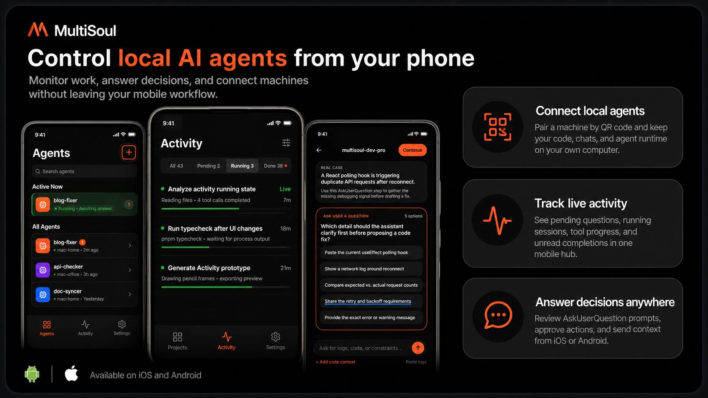

<p align="center">
  <h1 align="center">MultiSoul</h1>
  <p align="center">本地 AI Agent 的手机控制台。</p>
  <p align="center">
    <a href="ARCHITECTURE.md">系统架构</a>
    ·
    <a href="docs/product-specs/">产品规格</a>
    ·
    <a href="docs/runbooks/cli-release.md">CLI 发布</a>
  </p>
  <p align="center">
    <a href="https://github.com/yakami129/multisoul/stargazers">
      
    </a>
  </p>
  <p align="center">
    <a href="README.md">English</a> | 中文
  </p>
</p>

<p align="center">
  
</p>

---

MultiSoul 是一个个人 AI Agent 手机控制台。你可以用手机连接自己电脑上运行的 AI Agent，实时查看消息和工具调用，回复审批/选择问题，并接收任务完成通知。

MultiSoul 没有中心后端。`msctl` 运行在你的电脑上，数据保存在本机，手机通过 Tailscale 连接你自己的节点。

## 可以做什么

- 在手机上控制 Claude Code、Codex 或 Cursor Agent CLI
- 实时查看 Agent 消息、工具调用、工具结果和任务状态
- 在 App 内回复 `AskUserQuestion` 决策问题
- 用 Inbox 汇总待回复问题和任务完成/失败通知
- 一台手机通过 Tailscale 连接多台电脑
- 支持前台运行，也支持后台 daemon 常驻

## 工作方式

```
手机 App (React Native + Expo)
        │ Tailscale / HTTPS / WSS + Bearer token
        ▼
msctl serve (Rust，本机服务)
        ├── Runtime adapters: Claude Code / Codex / Cursor Agent CLI
        ├── REST + WebSocket
        └── SQLite: ~/.config/msctl/serve.db
```

## 依赖

- Node.js 18+
- 电脑和手机都安装 Tailscale
- 电脑上至少安装一个 Agent runtime：
  - Claude Code: `claude`
  - Codex CLI: `codex`
  - Cursor Agent CLI: `agent`
- Rust toolchain，仅从源码运行 `msctl` 时需要

## 安装 Tailscale

电脑和手机都需要安装 Tailscale，并登录到同一个 Tailnet。

官方安装文档：[tailscale.com/docs/install](https://tailscale.com/docs/install)

常见安装方式：

```bash
# macOS
# 从 https://tailscale.com/download/mac 安装

# Linux
curl -fsSL https://tailscale.com/install.sh | sh
sudo tailscale up

# 验证
tailscale status
tailscale ip
```

iOS 或 Android 直接从应用商店安装 Tailscale，并登录同一个账号。

默认推荐使用 Tailnet 私有访问。如果你需要公网 HTTPS 地址，可以开启 Tailscale Funnel，并用 `msctl serve --funnel` 启动服务。参考：[Tailscale Funnel docs](https://tailscale.com/docs/features/tailscale-funnel)。

## 快速开始

### 1. 安装 `msctl`

```bash
npm install -g @yakami129/msctl
```

从源码运行：

```bash
cd cli
cargo run -- --help
```

### 2. 启动 Agent 服务

安装 CLI 后最快方式：

```bash
msctl daemon quickstart --token test --port 8765 --tailnet true
```

从源码运行：

```bash
cd cli
cargo run -- daemon quickstart --token test --port 8765 --tailnet true
```

这个命令会保存 token，安装并启动后台服务，监听 Tailnet 可访问地址，并在终端生成一个二维码。

在手机 App 中打开：

```text
Settings -> Add Endpoint -> Scan QR
```

扫描终端里的二维码，即可把这台电脑注册为手机上的 MultiSoul 节点。

个人真实使用时，请把 `test` 换成自己的长 token。

常用 daemon 命令：

```bash
msctl daemon status
msctl daemon logs -f
msctl daemon restart
msctl daemon stop
```

前台运行方式：

```bash
msctl serve --tailnet --port 8765 --token test
```

### 3. 注册 Agent

Codex：

```bash
msctl agent register \
  --name work-codex \
  --project /path/to/project \
  --runtime codex \
  --mode full-auto
```

Claude Code：

```bash
msctl agent register \
  --name work-claude \
  --project /path/to/project \
  --runtime claude-code
```

Cursor Agent CLI：

```bash
msctl agent register \
  --name work-cursor \
  --project /path/to/project \
  --runtime cursor-cli \
  --mode ask
```

查看已注册 Agent：

```bash
msctl agent list
```

### 4. 本地运行手机 App

```bash
cd mobile
pnpm install
pnpm start
```

模拟器：

```bash
pnpm ios
pnpm android
```

## 开发

CLI：

```bash
cd cli
cargo build
cargo test
cargo run -- serve
```

Mobile：

```bash
cd mobile
pnpm install
pnpm typecheck
pnpm test -- --watchAll=false
pnpm start
```

## 本地数据

| 路径 | 用途 |
|------|------|
| `~/.config/msctl/serve.db` | Agent、对话、消息、任务、Push Token |
| `~/.config/msctl/config.toml` | 本地 `msctl` 配置 |
| `~/.config/msctl/uploads/` | 上传图片 |
| 手机本地存储 | 节点、token、Inbox 缓存 |

## 文档

- [ARCHITECTURE.md](ARCHITECTURE.md)：系统架构
- [docs/product-specs/](docs/product-specs/)：产品规格
- [docs/design-docs/](docs/design-docs/)：设计文档
- [docs/runbooks/cli-release.md](docs/runbooks/cli-release.md)：CLI 发布
- [mobile/docs/ios-publish.md](mobile/docs/ios-publish.md)：iOS 发布
