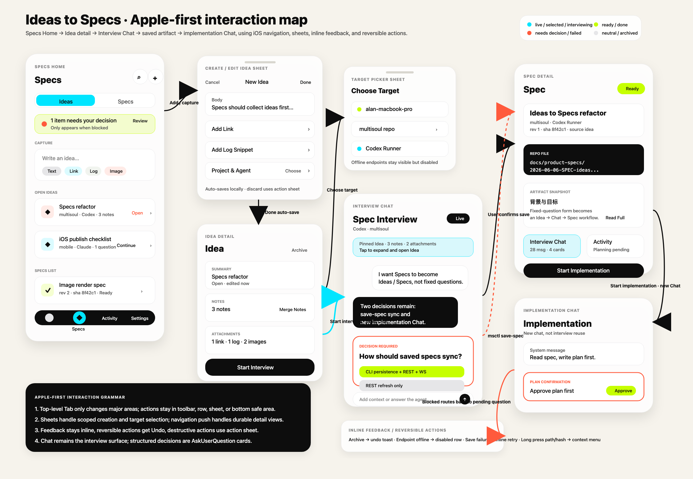

# Ideas to Specs 重构功能交互与 UI 设计

## 1. 设计输入

本文承接产品规格 [`docs/product-specs/2026-06-06-SPEC-ideas-to-specs-refactor.md`](../product-specs/2026-06-06-SPEC-ideas-to-specs-refactor.md)，把 Specs 模块从固定五题问答页升级为需求资产工作流。

视觉和交互输入：

- 品牌系统：[`mobile/docs/design.md`](../../mobile/docs/design.md)，保留 Cream Console、Ink Control、Signal Palette。
- Apple Human Interface Guidelines：以 Hierarchy、Harmony、Consistency、清晰反馈、渐进披露、系统导航和无障碍为约束。
- 本次原型图仅作为概念输入，不逐像素照搬：
  - 
  - 
  - 
- Apple-first 完整交互图：
  - 

本文只回答功能交互和 UI 方案，不写施工步骤；实施计划应另落 [`docs/exec-plans/`](../exec-plans/)。

## 2. Apple-first 设计原则

### 2.1 内容先于装饰

Specs 是工作流入口，不是宣传页。重设计后首屏优先展示可操作内容：

- 当前需要处理的 Idea / Spec。
- 可继续采访或需要回答的问题。
- 可实施的 Spec。

Hero、统计卡、mascot 只在帮助理解状态时出现，不占据稳定首屏主区域。默认界面使用 iOS 分组列表和清晰导航层级，把品牌质感放在材质、图标和状态色上。

### 2.2 层级清楚，动作就近

每个屏幕只有一个主要层级：

- Specs Home：浏览和捕捉。
- Idea Detail：整理想法和选择目标。
- Interview Chat：澄清需求。
- Spec Detail：阅读 artifact 和开始实施。

动作必须靠近它影响的对象：

- 新建 Idea 放在 navigation toolbar 和首个 inline capture row。
- 开始采访放在 Idea Detail 底部主按钮。
- 保存 spec 是 Chat 中的问答卡片决策。
- 开始实施放在 Spec Detail 底部主按钮。

### 2.3 渐进披露

手机端不一次展示所有元数据。列表只显示判断下一步所需的信息；详情页再展开 notes、附件、path、hash、snapshot、关联 Chat 和 Activity。

默认隐藏：

- 完整 markdown。
- 版本历史。
- 长 repo path 细节。
- 附件全文和日志全文。

通过 disclosure、sheet、copy action 或 detail view 展开。

### 2.4 反馈内联，少用中断

状态反馈优先出现在当前上下文：

- 保存中：Chat 内联进度。
- endpoint 离线：目标选择 sheet 内的不可用状态。
- spec 已保存：Chat 中出现 `View Spec` 行动。
- archive：底部 undo toast。

Alert 只用于不可逆且不常见的破坏性操作。提供多个选择时使用 action sheet / confirmation dialog。

### 2.5 直接操控和可逆操作

用户应能直接点列表行进入对象，直接 swipe archive，直接长按复制 path/hash。任何隐式或手势操作都必须有按钮替代。

### 2.6 品牌克制

保留 MultiSoul 的 Cream / Ink / Cyan / Coral / Lime，但使用方式更像 iOS 工具：

- Cream 是页面背景。
- 白色半透明 surface 是列表和分组。
- Ink 是文本、底部 Tab、主确认按钮。
- Cyan 表示 live / interviewing / selected。
- Coral 表示需要决策、阻塞或失败前置注意。
- Lime 表示 ready / done / confirmed。

Signal 色不能做大面积装饰，也不能只靠颜色表达状态。

## 3. 总体信息架构

底部 Tab 保持四个顶层区域：

```text
Agents / Specs / Activity / Settings
```

Tab bar 只用于顶层导航，不承载新建、保存、实施等动作。Specs 内部使用 navigation stack：

```text
Specs Home
  -> Idea Detail
      -> Target Picker Sheet
      -> Interview Chat
  -> Spec Detail
      -> Interview Chat
      -> Activity Item
      -> Implementation Chat
```

`Ideas / Specs` 是 Specs Home 内的内容过滤，不是全局 Tab。它使用 segmented control 或 native picker，保持当前位置滚动状态。

## 4. Specs Home

### 4.1 页面目标

让用户快速回答三个问题：

1. 现在有什么想法还没整理？
2. 哪些 spec 已经可以实施？
3. 有没有需要我处理的阻塞？

### 4.2 iOS 布局

```text
Navigation bar
  Large title: Specs
  Toolbar: search, add

Segmented control
  Ideas | Specs

Attention strip, only when needed

List
  Inline capture row, only in Ideas
  Idea rows or Spec rows

Tab bar
```

取消原型中的大 hero 和三张 stats card。原因：

- 它们占据首屏但不直接完成任务。
- 统计数字对个人控制台是次要信息。
- iOS 列表页应让内容本身成为层级中心。

需要保留品牌呼吸时，把 mascot 放到空状态、attention strip 或 navigation title 左侧小图标，不放在每次打开都压住列表的大卡里。

### 4.3 Navigation bar

- 使用大标题 `Specs`。
- 副标题不固定显示；需要时可在列表首个 section header 写 `Ideas into executable plans`。
- 右侧 toolbar：
  - Search：打开原生搜索状态或聚焦搜索框。
  - Add：创建 Idea，打开 Create Idea sheet。
- 如果存在待处理问题，Add 旁或 Specs Tab 使用 badge，但不改变按钮行为。

### 4.4 Segmented control

- 放在 navigation content 下方，随列表顶部滚动或吸顶均可。
- 两段：`Ideas`、`Specs`。
- 选中态使用 Cyan light fill，文字 Ink。
- 切换后保持对应段的 scroll offset。
- 不在 navigation bar 内同时放 title 和 segmented control，避免头部拥挤。

### 4.5 Attention strip

只有存在 `blocked` 或待答 AskUserQuestion 时出现。

```text
1 item needs your decision
Review
```

规则：

- 位置在 segmented control 下方。
- 使用 Lime 或 Coral 边/点，不用整屏大警告。
- 点击 `Review` 跳到最紧急的 blocked Chat / Activity。
- 没有待处理事项时完全隐藏。

### 4.6 Ideas 段列表

Section 结构：

```text
Capture
Open Ideas
Converted Recently
Archived, collapsed
```

`Capture` section 的第一行是 inline capture row：

```text
Write an idea...
Text  Link  Log  Image
```

交互：

- 点输入区打开 Create Idea sheet，不在列表内直接展开成长表单。
- 点 `Link` / `Log` / `Image` 打开同一个 sheet，并预选附件类型。
- 提交后新 Idea 插入 `Open Ideas` 顶部。

### 4.7 Idea row

采用 iOS List row 密度，不使用独立大卡。

```text
[status glyph]  Title
                repo · agent
                notes · attachments · last updated
        trailing: status / action chevron
```

展示规则：

- 高度 72-88 pt，可随 Dynamic Type 增长。
- 标题最多两行。
- 副文案一行，必要时中间截断 repo path。
- trailing 不放大按钮；行本身可点击进入详情。
- `interviewing` 可在 trailing 显示 `Continue` pill。
- `converted` 显示 `Spec saved`，点击仍进入 Idea Detail，详情里提供 `View Spec`。

列表手势：

- Swipe leading：`Start` / `Continue`。
- Swipe trailing：`Archive`。
- Archive 必须可 Undo。
- 所有 swipe 动作都在 detail 中有按钮替代。

### 4.8 Specs 段列表

Section 结构：

```text
Needs You
Ready
In Progress
Done
```

只有有内容的 section 出现。`Needs You` 永远排最上方。

Spec row：

```text
[doc glyph]  Title
             repo path
             rev N · sha short · activity summary
     trailing: status chip / chevron
```

规则：

- 默认展示最新版本。
- 不在 row 里展示 markdown 摘要。
- `ready` 不自动开始实施，必须进入 Spec Detail 或通过显式 swipe action。
- `blocked` row 使用 Coral status dot + 文案，不能只变色。

## 5. Create / Edit Idea Sheet

### 5.1 使用 sheet 的原因

创建 Idea 是当前列表上下文中的 scoped task，适合 iOS sheet。它不应跳到全屏新页，避免用户失去列表上下文。

### 5.2 Sheet detents

- 默认 medium detent：输入一句想法、选择附件类型。
- 内容变多或键盘出现时扩到 large detent。
- 有未保存内容时，下滑关闭触发 action sheet：`Save Draft`、`Discard`、`Cancel`。

### 5.3 Sheet 布局

```text
Toolbar
  Cancel
  Title: New Idea / Edit Idea
  Done

Form
  Title, optional
  Body text area
  Attachments
  Target
```

控件：

- Title 自动从 body 首行生成，可手动覆盖。
- Body 是多行文本输入，首屏至少 120 pt。
- Attachments 用 row 而非彩色 chip 堆叠：
  - Add Link
  - Add Log Snippet
  - Add Screenshot
- Target 是一个 form row：`Project & Agent`，未选时显示 `Choose`。

### 5.4 Auto-save

Idea 编辑应本地自动保存，避免用户在手机上担心丢内容。

- `Done` 表示关闭，不表示唯一保存点。
- 保存失败使用 inline footer：`Couldn't save locally. Retry`。
- 成功不弹 alert。

## 6. Idea Detail

Idea Detail 是完整整理页，使用 navigation push，而不是永久 sheet。用户从列表点 row 进入。

布局：

```text
Navigation bar
  Title: Idea
  Toolbar: archive / more

Grouped form
  Summary
  Notes
  Attachments
  Target
  Related

Safe-area bottom action
  Start Interview / Continue Interview / View Spec
```

### 6.1 Summary section

- Title field。
- Body preview，点击进入编辑 sheet。
- Status row：Open / Interviewing / Converted / Failed。

### 6.2 Notes section

- Notes 按时间倒序。
- `Add Note` 是 section footer button。
- `Merge Notes` 进入 edit mode，让用户勾选 notes 后合并。
- 合并是可逆操作：合并后显示 Undo toast。

### 6.3 Attachments section

每个附件是一行：

```text
icon  title or summary
      kind · size/line count/status
```

- Link：显示 host。
- Log：显示行数和首行摘要。
- Image：显示小缩略图，失败时显示 retry。
- 上传失败不阻止继续编辑 Idea；开始采访时提醒该附件不可用。

### 6.4 Target section

行结构：

```text
Project & Agent
multisoul · Codex Runner
```

点击打开 Target Picker sheet。未选择 target 时底部主按钮禁用，并显示 footer：`Choose a project and agent before starting an interview.`

## 7. Target Picker Sheet

Target Picker 是从 Idea Detail 发起的 scoped task。

布局：

```text
Toolbar: Cancel / Choose Target / Done
Search field
Endpoint list
Agent list, filtered by endpoint/repo
```

规则：

- medium detent 展示最近 target；large detent 展示完整选择。
- Endpoint offline 时 row 保持可见但 disabled，副文案解释原因。
- 选择 endpoint 后展开 repo/agent，而不是跳新页。
- `Done` 只在 target 完整时启用。
- 无 agent 时提供 `Open Agents`，但不在 sheet 内注册 agent。

## 8. Interview Chat

### 8.1 页面目标

Interview Chat 让用户继续用熟悉的 Chat 心智完成需求澄清，同时明确这是从某个 Idea 发起的采访。

### 8.2 布局

```text
Navigation bar
  Back
  Title: Spec Interview
  Subtitle: Codex · multisoul
  More

Pinned Idea summary, collapsible
Transcript
AskUserQuestion cards
Composer
```

删除原型中的固定 readiness 大卡。原因：

- 它占用对话空间。
- 如果 readiness 不是后端权威字段，客户端不应猜。
- iOS 聊天界面应让对话成为主内容。

Readiness 改成可选的 compact metadata：

- 放在 Pinned Idea 展开态或 navigation subtitle 的 accessory。
- 只显示后端/agent 明确给出的状态。
- 不足时隐藏，不显示假进度。

### 8.3 Pinned Idea summary

默认折叠成一行：

```text
Pinned Idea · 3 notes · 2 attachments
```

点击展开：

- Idea 标题。
- Body 摘要。
- Attachment 摘要。
- Target repo/agent。
- `Open Idea`。

视觉：

- 使用轻量 Cyan tint，不使用大面积高饱和 Cyan。
- 可以放小 mascot，但不得遮挡文字或成为主视觉。

### 8.4 AskUserQuestion card

问答卡片是 Interview 中最高优先级控件。

结构：

```text
Decision Required
Question
Options
Confirm
```

规则：

- 问题卡在消息流中占据独立 block。
- Coral 用作 label / top border / status dot，不整卡染红。
- 选项使用 iOS list selection 语义：未选白底，选中 Lime tint + checkmark。
- Confirm 使用 Ink filled button。
- 多选题在选项右侧显示 checkmark。
- 禁止让用户在自由文本里输入选项编号。

### 8.5 Composer

- 保持 Chat 现有 composer 心智。
- Placeholder：`Add context or answer the agent...`
- 左侧 `+` 打开 attachment/action menu。
- 常用动作在 menu 内：Attach log、Add screenshot、Ask choice。
- 键盘出现时隐藏底部 Tab，保留 composer safe area。

### 8.6 保存 spec 的反馈

保存过程是 Chat 中的一组内联 system rows：

```text
Writing repo file...
Saving artifact...
Spec saved
View Spec
```

失败：

- 用 inline error row 显示具体原因。
- 提供 `Retry Save` 和 `Continue Interview`。
- 不弹 alert，除非路径越界或权限问题需要用户立即理解风险。

## 9. Spec Detail

### 9.1 页面目标

Spec Detail 不是“工作台海报”，而是 iOS detail view：让用户确认 spec 来源、查看 artifact、打开相关上下文、开始实施。

### 9.2 布局

```text
Navigation bar
  Title: Spec
  Toolbar: copy / more

Grouped sections
  Overview
  Repo File
  Artifact Snapshot
  Related
  Status

Safe-area bottom action
  Start Implementation
```

### 9.3 Overview section

```text
Title
repo · agent
rev N · sha short · status
source idea
```

规则：

- 标题用动态字号，最多三行。
- Status chip 小而明确。
- Source Idea 是 tappable row，不是装饰 chip。

### 9.4 Repo File section

```text
Path
docs/product-specs/...
```

交互：

- 点 path 复制。
- 长按弹 context menu：Copy Path、Copy Hash、Open Interview Chat。
- 长 path 横向滚动或按 slash 断行，不按字符断开。

### 9.5 Artifact Snapshot section

默认展示摘要版：

- `背景与目标` 前两段。
- `验收标准` 前 3 条。
- `未决问题` 如果存在则显示。

底部按钮：

- `Read Full Spec`：push 到 markdown reader。
- `Copy Markdown Hash`。

Markdown reader：

- 只读。
- 支持搜索。
- 不提供长文编辑器。

### 9.6 Related section

Rows：

- Interview Chat：`28 messages · 4 decisions`
- Activity：`Planning pending` / `Needs answer` / `Done`
- Source Idea：`Archived` / `Converted`

每行可点进对应上下文，保持普通 navigation push。

### 9.7 Bottom action

底部 safe-area 按钮：

```text
Start Implementation
```

副文案放按钮上方的 helper text：

```text
Creates a new chat and asks the agent to write a plan first.
```

规则：

- `ready` 状态启用。
- `planning` / `implementing` 显示 `Open Implementation Chat`。
- `blocked` 显示 `Answer Required`，跳到 pending question。
- endpoint 离线时禁用，并显示 inline footer。

## 10. Implementation Chat

开始实施必须新建 Chat。

首条消息由系统注入：

```text
Read <repoSpecPath>.
Write an implementation plan first.
Wait for user confirmation through AskUserQuestion.
After confirmation, implement.
If blocked, ask through AskUserQuestion.
Report changed files and verification.
```

计划确认：

- Agent 发出 plan 后必须出现问答卡片。
- 选项建议：`Approve plan`、`Revise scope`、`Stop for now`。
- 用户批准前不进入 implementing。

## 11. 状态映射

### 11.1 Idea

| Status | 文案 | iOS 表达 | 主动作 |
|--------|------|----------|--------|
| `open` | Open | neutral row + Coral dot when stale | Start Interview |
| `interviewing` | Interviewing | Cyan dot + subtitle | Continue |
| `converted` | Spec Saved | Lime check + related row | View Spec |
| `archived` | Archived | muted section | Unarchive |
| `failed` | Failed | inline error row | Retry |

### 11.2 Spec

| Status | 文案 | iOS 表达 | 主动作 |
|--------|------|----------|--------|
| `draft` | Draft | neutral chip | Review |
| `ready` | Ready | Lime check | Start Implementation |
| `planning` | Planning | Cyan progress row | Open Chat |
| `implementing` | Running | Cyan activity summary | Open Activity |
| `blocked` | Needs You | Coral dot + top section | Answer |
| `done` | Done | Lime check | Open Summary |
| `failed` | Failed | inline error row | Review |

冲突优先级：

```text
blocked > failed > implementing > planning > done > ready > draft
```

## 12. 反馈、错误和空状态

### 12.1 空状态

Ideas 空：

- 标题：`Capture your first idea`
- 副文案：`Start with one sentence. You can add links, logs, and screenshots later.`
- 主动作：`New Idea`

Specs 空：

- 标题：`No saved specs`
- 副文案：`Interview an idea, then save a repo spec artifact.`
- 主动作：`Go to Ideas`

空状态可以使用 mascot，但保持小尺寸，不做大幅插画页。

### 12.2 Endpoint offline

不要弹 alert。显示在相关位置：

- Target Picker row disabled。
- Idea Detail bottom footer。
- Spec Detail bottom footer。

动作：`Retry`、`Open Settings`。

### 12.3 Destructive actions

- Archive：直接执行 + Undo。
- Delete local draft：action sheet 确认。
- Discard unsaved sheet changes：action sheet。
- 不可恢复删除才用 alert。

### 12.4 Save-spec failure

| Error | 表达 | 动作 |
|-------|------|------|
| path 越界 | inline critical row | Continue Interview |
| 文件不存在 | inline error | Retry Save |
| markdown 为空 | inline error | Ask agent to rewrite |
| hash/version 新增 | passive success | View Spec |
| WS 丢失 | 不提示 | REST refresh |

## 13. 手势和导航

- Back 保持 iOS navigation stack 行为。
- 从 push notification 进入时，Back 返回 Specs Home。
- Swipe actions 不替代按钮。
- Long press path/hash 打开 context menu。
- Pull to refresh 刷新 Ideas / Specs 当前段。
- Search 进入系统搜索状态，取消后恢复列表位置。

## 14. 无障碍和适配

- iOS 默认触控目标 44x44 pt；自定义控件不得小于该尺寸。
- Dynamic Type 下列表 row 可增长，trailing action 不遮挡标题。
- VoiceOver label 包含对象、状态、下一步动作：
  `Spec 模块重构, interviewing, one open question, continue interview`。
- 颜色不是唯一状态信号；dot/chip 必须有文字或图标。
- 支持 Reduce Motion：关闭 running pulse，仅保留静态状态。
- 键盘出现时 composer 贴合 keyboard layout，Tab bar 隐藏或让出空间。
- 所有底部主按钮避开 Home Indicator。
- iPad 横屏可用两栏：左侧 Ideas/Specs 列表，右侧 detail；iPhone 始终 single-column stack。

## 15. 与既有模块边界

- Specs 管理 Idea/Spec 资产，不承载完整执行日志。
- Chat 承载采访和实施对话。
- Activity 承载执行状态和待处理事项。
- Settings/Agents 仍负责 endpoint 和 agent 管理。
- Mobile 不从任意 markdown 消息猜测 spec；Spec 必须来自 `save-spec` artifact。
- Mobile 不在 V1 提供 markdown 正文编辑器。

## 16. V1 取舍

### 16.1 历史版本

V1 只展示最新版本，并显示 `rev N` 和 hash short。版本列表、diff、回滚进 V2。

### 16.2 截图附件

V1 UI 复用现有 Chat upload/file_id 管线，不建立 Specs 专属图片系统。Specs 只保存附件引用和摘要。

### 16.3 Readiness

V1 不在客户端猜测 readiness。只有 agent/后端提供结构化字段时才显示 compact readiness。

### 16.4 Status 派生

V1 不引入 Run 对象。Spec 状态由 artifact、implementation Chat、Activity 和 pending AskUserQuestion 派生。

## 17. 实施验收用 UI Checklist

- [ ] Specs Home 使用 iOS navigation stack + grouped list，不再用大 hero 和 stats card 占据首屏。
- [ ] Tab bar 只做顶层导航，所有动作放 toolbar、row action、sheet 或 bottom action。
- [ ] `Ideas / Specs` 是页面内 segmented control，并保持各自滚动状态。
- [ ] 新建和编辑 Idea 使用 sheet，支持 medium/large detent 与未保存变更 action sheet。
- [ ] Idea Detail 使用 grouped form，底部主按钮随状态变化。
- [ ] Target Picker 是 scoped sheet，endpoint offline 时 row disabled 且有解释。
- [ ] Interview Chat 复用普通 Chat，Pinned Idea 默认折叠。
- [ ] Readiness 不是常驻大卡；无权威字段时隐藏。
- [ ] 结构化决策只通过 AskUserQuestion 卡片出现。
- [ ] 保存 spec 的进度和失败反馈在 Chat 内联显示。
- [ ] Spec Detail 是 grouped detail view，artifact snapshot 渐进披露。
- [ ] Start Implementation 是底部 safe-area 主按钮，创建新 Chat。
- [ ] `blocked` 在列表最上方出现，并提供直接 Answer 路径。
- [ ] Archive、discard、delete 等操作遵守可逆优先、必要时 action sheet。
- [ ] 所有控件满足 44x44 pt，支持 Dynamic Type、VoiceOver、Reduce Motion。
- [ ] 所有颜色来自 `mobile/docs/design.md` §2 色板，Signal 色只表达状态。
