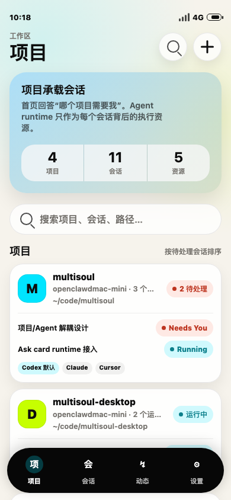
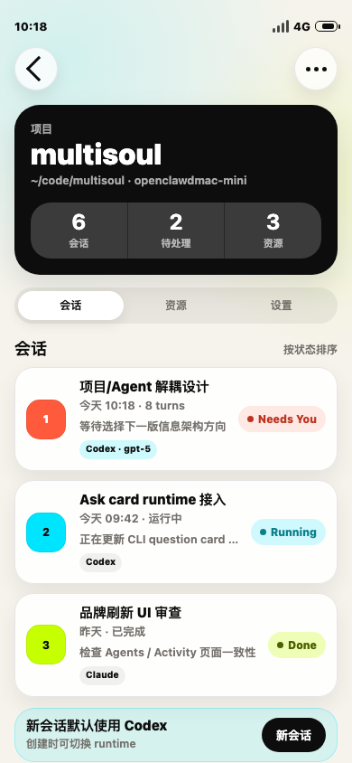
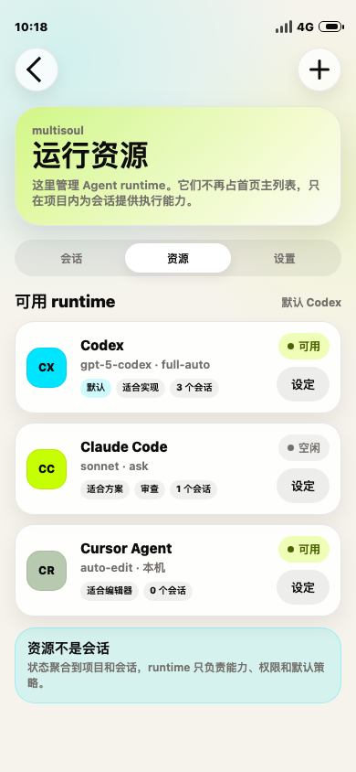
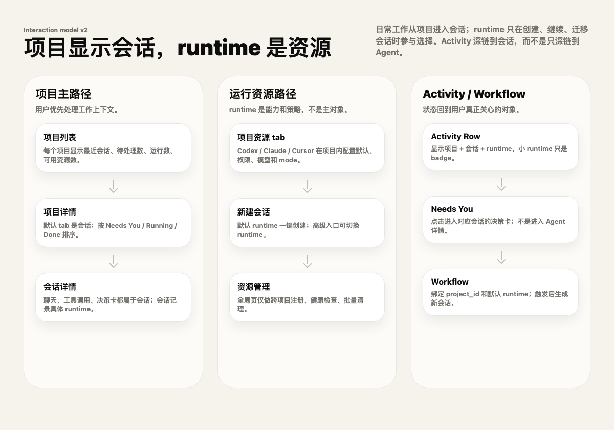

# Project / Session / Resource 模型重构设计

## 1. 设计输入

本文承接产品规格 [`docs/product-specs/2026-06-25-SPEC-project-session-resource-model.md`](../product-specs/2026-06-25-SPEC-project-session-resource-model.md)，把 MultiSoul 从 Agent-first 导航重构为 Project / Session / Resource 模型。

已确认的产品决策：

- 用户语言：项目 / 会话 / 资源。
- Project 第一版身份：`endpoint_id + normalized_project_path`。
- 单个 `msctl serve` DB 内不持有 endpoint id，因此 server 侧按 normalized path 去重；mobile 聚合层用 `endpoint_id:project_id` 做全局 key。
- 会话归项目，并绑定执行资源。
- 资源作用域为项目内资源。
- 旧 `/agents` API 和 `msctl agent` 命令第一阶段保留。
- 实施顺序：后端模型 -> 移动端 -> 清理。

本文只回答“为什么这样设计”和关键契约，不写施工步骤；施工计划应另落 [`docs/exec-plans/`](../exec-plans/)。

### 1.1 原型参考（AI 实施参考）

以下原型用于说明信息架构和交互关系，不要求 pixel-perfect 复刻。实施时应优先保留对象层级、状态表达和导航路径，再按 `mobile/docs/design.md` 落地具体组件。

#### 项目首页



实施关注点：

- 底部“智能体”入口改为“项目”。
- 首页主对象是 project card，而不是 agent/resource card。
- 每个 project card 内展示最近/待处理会话。
- Codex / Claude / Cursor 只作为项目内资源 chip，不抢主标题。
- 项目排序优先反映待处理/运行中会话。

#### 项目详情：会话优先



实施关注点：

- Project detail 默认选中“会话”。
- 会话是用户处理的任务对象，列表按 `Needs You -> Running -> Done` 排序。
- resource/runtime 显示为会话 badge，说明该会话由哪个资源执行。
- “新会话”默认使用项目默认资源，但应允许高级切换。

#### 项目资源页



实施关注点：

- 资源页只管理项目内 runtime resources。
- 默认资源应清晰标记。
- 资源状态用于配置和健康检查，不作为日常工作入口排序依据。
- 文案避免继续把资源称为“智能体舰队”主对象。

#### 交互流



实施关注点：

- 主路径：项目列表 -> 项目详情 -> 会话详情。
- 资源路径：项目资源 tab -> 新建会话选择默认/高级 runtime -> 资源管理。
- Activity / Push 深链到 conversation/decision card，而不是 agent/resource detail。
- Workflow 绑定 project_id 和默认 resource，触发后生成项目下的新会话。

## 2. 现状问题

当前核心表：

```text
agents(id, name, project_path, runtime, mode, created_at, ...)
conversations(id, agent_id, title, status, ...)
messages(conversation_id, ...)
workflows(agent_id, ...)
```

问题在于 `agents.project_path` 同时承担三个角色：

1. 项目身份。
2. runtime 执行 cwd。
3. mobile 首页卡片信息。

当一个 project path 注册多个 runtime 后，首页会出现多张高度相似的 Agent 卡片。用户真正关心的是“哪个项目的哪个会话需要处理”，而不是“哪个 agent 记录存在”。

## 3. 方案总览

新增项目层，同时保留 Agent 作为执行资源记录：

```text
projects
  id
  name
  project_path
  normalized_project_path
  default_agent_id

agents
  id
  project_id
  name
  project_path       # phase 1 compatibility
  runtime
  mode

conversations
  id
  project_id
  agent_id           # execution resource binding
  status
  model_id
```

关键原则：

- **Project 是导航对象**：mobile 首页、project detail、Specs、Workflow 先选择项目。
- **Conversation/Session 是工作对象**：Activity、Push、Chat、决策卡都深链到 conversation。
- **Agent 是执行资源**：runtime dispatch 仍使用 `agent_id`，但用户界面称为 resource。
- **兼容优先**：phase 1 不删除旧字段和旧 API。

## 4. DB 设计

### 4.1 `projects`

建议 schema：

```sql
CREATE TABLE IF NOT EXISTS projects (
  id                      TEXT PRIMARY KEY,
  name                    TEXT NOT NULL,
  project_path            TEXT NOT NULL,
  normalized_project_path TEXT NOT NULL UNIQUE,
  default_agent_id        TEXT REFERENCES agents(id) ON DELETE SET NULL,
  created_at              INTEGER NOT NULL,
  updated_at              INTEGER NOT NULL
);
```

说明：

- `project_path` 保留用户可读路径。
- `normalized_project_path` 用于同一个 server DB 内去重。
- `default_agent_id` 指向项目默认执行资源。由于 SQLite 外键循环问题，phase 1 可以先建 nullable 字段并在 agents backfill 后更新。
- `name` 默认取 path basename，后续可允许用户重命名。

### 4.2 `agents.project_id`

新增：

```sql
ALTER TABLE agents ADD COLUMN project_id TEXT REFERENCES projects(id);
```

保留：

```text
agents.project_path
```

保留原因：

- 旧 `/agents` API 仍需要返回 project_path。
- runtime dispatch 当前多处依赖 agent -> project_path。
- Specs / Workflow / tests 的旧 fixture 可渐进迁移。

代码应逐步把 `agent.project_path` 视为 `project.project_path` 的兼容镜像。新增写路径必须先解析 project，再写 agent.project_id。

### 4.3 `conversations.project_id`

新增：

```sql
ALTER TABLE conversations ADD COLUMN project_id TEXT REFERENCES projects(id);
```

回填：

```sql
UPDATE conversations
SET project_id = (
  SELECT agents.project_id
  FROM agents
  WHERE agents.id = conversations.agent_id
)
WHERE project_id IS NULL;
```

phase 1 可先允许 nullable，以便兼容旧数据；应用层创建新 conversation 必须写入 project_id。后续 cleanup 再考虑强制非空。

### 4.4 Migration 回填规则

对现有 agents：

1. normalize `project_path`。
2. 对每个 distinct normalized path upsert 一条 project。
3. 将 agents.project_id 指向对应 project。
4. 为每个 project 选择默认 agent：
   - 优先 runtime = `codex`。
   - 其次 created_at 最新或最早需统一；推荐最新，符合用户最近注册偏好。
   - 如果只有一个 agent，选它。
5. 回填 conversations.project_id。

## 5. API 设计

### 5.1 新增 Project API

```text
GET  /api/v1/projects
GET  /api/v1/projects/:id
GET  /api/v1/projects/:id/conversations
GET  /api/v1/projects/:id/resources
POST /api/v1/projects/:id/conversations
```

#### `GET /api/v1/projects`

返回 mobile 首页所需聚合，避免 N+1：

```json
[
  {
    "id": "project-id",
    "name": "multisoul",
    "project_path": "/repo/multisoul",
    "created_at": 1,
    "updated_at": 2,
    "default_agent_id": "agent-codex",
    "resource_count": 3,
    "pending_session_count": 2,
    "running_session_count": 1,
    "completed_session_count": 24,
    "last_message_at": 2,
    "recent_sessions": [
      {
        "id": "conv-id",
        "title": "项目/Agent 解耦设计",
        "status": "awaiting_question",
        "agent_id": "agent-codex",
        "resource_name": "Codex"
      }
    ],
    "resources": [
      { "id": "agent-codex", "name": "Codex", "runtime": "codex", "is_default": true }
    ]
  }
]
```

排序可由 server 提供，mobile 也可防御性排序。server 排序优先级应与产品规格一致：

```text
awaiting_question project
running project
failed latest session
last_message_at desc
created_at desc
```

#### `GET /api/v1/projects/:id/conversations`

复用现有 Conversation Row 字段，新增 project/resource metadata：

```json
{
  "id": "conv-id",
  "project_id": "project-id",
  "agent_id": "agent-id",
  "agent_name": "multisoul-codex",
  "resource_name": "Codex",
  "title": "...",
  "status": "running",
  "model_id": null
}
```

#### `GET /api/v1/projects/:id/resources`

返回项目内 agents 的 resource view：

```json
{
  "id": "agent-id",
  "project_id": "project-id",
  "name": "multisoul-codex",
  "display_name": "Codex",
  "runtime": "codex",
  "mode": "full-auto",
  "is_default": true,
  "created_at": 1
}
```

### 5.2 Legacy Agents API

`GET /api/v1/agents` 和 `GET /api/v1/agents/:id` 第一阶段保持旧 shape。实现可以 join projects，但输出必须兼容：

```json
{
  "id": "agent-id",
  "name": "multisoul-codex",
  "project_path": "/repo/multisoul",
  "runtime": "codex",
  "created_at": 1
}
```

新增字段若要返回，必须保证 mobile 旧类型忽略后不破坏。

## 6. Runtime Dispatch 设计

现有 message route 根据 conversation -> agent -> runtime/mode/project_path 发送消息。phase 1 维持这条链路：

```text
conversation.agent_id
  -> agents.runtime / agents.mode / agents.project_path
  -> runtime::send_to_session(...)
```

新增 project_id 只用于导航、查询和聚合，不改变 runtime worker 协议。

创建新会话时：

1. 接收 project_id。
2. 如果请求未传 resource/agent id，取 project.default_agent_id。
3. 创建 conversation，写入 project_id 和 agent_id。
4. 按旧 runtime dispatch 路径发送首条 user message。

## 7. CLI 设计

### 7.1 保留 `msctl agent`

`msctl agent codex` 继续是最短路径。内部行为改为：

```text
cwd -> normalize path -> upsert project -> upsert/register agent resource -> inject context
```

`msctl agent register --project /path --runtime codex` 同理先 upsert project。

### 7.2 新增语义命令

建议新增：

```text
msctl project list
msctl project get <id>
msctl resource list --project <id|path>
msctl resource register --project <id|path> --runtime <runtime> --name <name>
```

这些命令让用户文档逐步从 Agent 语言迁移到 Project/Resource 语言。phase 1 可先实现只读命令，注册仍复用 `agent register`。

## 8. Mobile 设计

### 8.1 类型

新增类型：

```ts
interface Project {
  id: string;
  name: string;
  project_path: string;
  default_agent_id: string | null;
  resource_count: number;
  pending_session_count: number;
  running_session_count: number;
  completed_session_count: number;
  recent_sessions: ProjectSessionSummary[];
  resources: ProjectResourceSummary[];
  endpoint_id: string;
  endpoint_label: string;
}

interface ProjectSession extends Conversation {
  project_id: string;
  resource_name: string;
}

interface ProjectResource {
  id: string; // agent_id
  project_id: string;
  name: string;
  display_name: string;
  runtime: Agent['runtime'];
  mode?: string;
  is_default: boolean;
}
```

### 8.2 数据服务

新增 `features/projects`：

```text
fetchProjectsFromEndpoint
fetchAllProjects
fetchProject
fetchProjectConversations
fetchProjectResources
createProjectConversation
```

Mobile 聚合 key：

```ts
const globalProjectKey = `${endpoint_id}:${project.id}`;
```

不要用 project path 作为 global key，因为不同 endpoint 可以有相同 path。

### 8.3 UI 路由

第一阶段可复用现有 Agents tab route，但改名和内容：

```text
app/(tabs)/index.tsx -> ProjectListScreen
features/projects/components/ProjectList.tsx
features/projects/components/ProjectDetail.tsx
features/projects/components/ProjectResources.tsx
```

旧 `features/agents` 保留给兼容路径和旧 API service，逐步改为 resource helper。

### 8.4 Activity deep link

Activity item 应携带 conversation_id 和 project_id。点击时优先：

```text
conversation_id -> chat detail
project_id -> project detail fallback
agent_id/resource_id -> resource fallback only
```

awaiting question 需要在 chat detail 内定位 pending ask。

## 9. Specs / Workflows 设计

### 9.1 Target 类型

从 AgentTarget 迁移到 ProjectTarget：

```ts
interface ProjectTarget {
  endpointId: string;
  endpointLabel: string;
  projectId: string;
  projectName: string;
  repoPath: string;
  defaultResourceId: string | null;
  defaultResourceName?: string;
}
```

高级模式可额外选择 resource override：

```ts
resourceId?: string;
```

### 9.2 Workflow

后端 workflows 当前绑定 agent_id。phase 1 可以新增 project_id 和 default/override agent_id：

```text
workflows.project_id
workflows.agent_id # resource override / resolved default
```

触发时必须创建 conversation.project_id。若 workflow 没有 explicit agent_id，使用 project.default_agent_id。

## 10. 方案权衡

### 10.1 为什么不是只在 mobile 聚合 Agent？

只在 mobile 聚合能快速隐藏重复卡片，但无法解决：

- Activity / Push 不知道项目会话层级。
- Specs / Workflows 仍绑定 Agent。
- 旧 conversations 无 project_id，项目详情查历史会话只能 N+1 聚合。
- 多 endpoint 排序容易不一致。

因此它只能作为临时 UI patch，不适合作为分阶段完整模型。

### 10.2 为什么不一次迁移到 `resources` 表？

新建 resources 表语义更干净，但会大幅增加第一阶段风险：

- runtime dispatch、routes、tests 全部依赖 agent_id。
- 旧 API 和 CLI 都以 agent 命名。
- 多 runtime 已经稳定落在 agents 表。

第一阶段把 agents 解释为 project-scoped resources，更符合兼容优先。

### 10.3 为什么 conversations 同时保留 `agent_id`？

会话需要稳定记录实际执行资源：

- 历史消息要知道由哪个 runtime 执行。
- resume session 需要 runtime-specific session id。
- model/mode 选择依赖 resource。

因此 `project_id` 解决导航和聚合，`agent_id` 解决执行绑定。

## 11. 测试策略

测试从产品规格的 E2E 文档派生：

- DB migration unit/integration tests。
- Projects API route tests。
- Legacy Agents API regression tests。
- Runtime dispatch regression tests。
- Mobile ProjectList / ProjectDetail component tests。
- Activity deep link tests。
- Specs / Workflow target picker regression tests。

见 [`2026-06-25-SPEC-project-session-resource-model-e2e.md`](../product-specs/2026-06-25-SPEC-project-session-resource-model-e2e.md)。

## 12. 清理阶段

后续 cleanup 可考虑：

- 将 mobile `features/agents` 改名或收敛为 `features/resources`。
- 将用户文档中 Agent-first 文案替换为 Project/Session/Resource。
- 为 `/agents` 添加 deprecation 注释，但不立即移除。
- 在所有新 API 稳定后，评估是否删除 `agents.project_path` 或改为生成字段。
