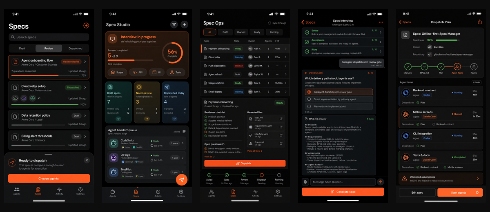

# Spec 管理模块 SPEC

## 1. 背景与目标

MultiSoul 当前已经具备 Agents 列表、Agent Detail、Chat、结构化问答卡片、Activity 状态聚合等基础能力。新的 Spec 管理模块要把这些能力串成一条产品闭环：用户在手机上通过 AI 结构化问答澄清需求，生成规范化 `SPEC.md`，确认后派发给本地运行的 agent 执行，并在 Activity 中跟踪执行状态。

第一阶段目标不是做完整的需求资产库，也不是做复杂的多 agent 编排系统，而是验证最短价值链：

```text
需求采访 → SPEC.md → 单 agent 执行 → Activity 回流
```

如果该闭环跑通，MultiSoul 就不只是“遥控 agent 的聊天入口”，而是可以把模糊需求转化为可执行规格并交付给 agent 的随身控制台。

## 2. 范围

### 2.1 In Scope

- 新增 `Specs` 一级 Tab，底部导航调整为 `Agents / Specs / Activity / Settings`。
- 在 App 本地创建、保存和管理 spec 草稿、问答记录、生成结果和状态。
- 使用结构化问答卡片采访需求，每轮主要展示 1-3 个问题，每题 2-4 个选项，并保留 `Other` 自定义输入。
- 用户手动点击 `Generate Spec` 后生成只读 `SPEC.md` preview。
- Review 阶段只提供 `Approve` 和 `Ask More` 两个核心动作。
- Dispatch 阶段将确认后的 spec 写入目标 repo：
  `docs/product-specs/YYYY-MM-DD-SPEC-<slug>.md`。
- 第一版仅支持单个 spec 派发给单个 agent。
- Agent 收到 spec 文件路径和简短执行指令。
- 派发后的执行状态复用现有 Activity item 展示。
- Specs 详情页展示关联 Activity / conversation 的状态摘要和跳转入口。

### 2.2 Out of Scope

- 多 agent 并行派发。
- 自动拆任务、依赖编排或 Dispatch Plan 任务图。
- 手机端直接编辑长篇 `SPEC.md`。
- spec 版本 diff、历史回滚和复杂版本管理。
- 高级搜索、复杂筛选、标签体系和归档。
- spec 模板市场或多模板选择。
- 自动生成 implementation plan。
- 自动 commit、自动 PR 或 GitHub PR 深度集成。

## 3. 用户与使用场景

### 3.1 典型用户

- 在本地仓库中使用 Claude Code / Codex / Cursor CLI 等 agent 的个人开发者。
- 使用 MultiSoul 在手机端查看 agent 状态、回答问题并派发工作的用户。

### 3.2 关键使用场景

1. 用户有一个粗略功能想法，但不想在手机上写长文档。
2. 用户从 `Specs` Tab 新建 spec，选择目标项目 / agent。
3. AI 以结构化问答卡片采访需求，用户主要通过点选完成回答。
4. 用户认为信息足够后手动生成 `SPEC.md` preview。
5. 用户确认后派发给一个 agent。
6. CLI 在目标 repo 写入 spec 文件，agent 根据文件路径执行。
7. 用户在 Activity 中看到执行状态；如 agent 需要进一步决策，继续通过问答卡片处理。

## 4. 业务流程与信息架构

### 4.1 高层流程

```text
1. 用户进入 Specs Tab
2. 点击 New Spec
3. 选择目标项目 / agent
4. 进入 Spec Interview
5. AI 发起结构化问答卡片
6. App 本地持续保存问答记录和 spec draft state
7. 用户点击 Generate Spec
8. 系统生成只读 SPEC.md preview，状态进入 Review
9. 用户选择：
   - Ask More：回到 Interview 继续补充
   - Approve：进入可派发状态
10. 用户点击 Dispatch
11. CLI 写入目标 repo 的 docs/product-specs/YYYY-MM-DD-SPEC-<slug>.md
12. Agent 收到 spec 文件路径和简短执行指令
13. Agent 开始执行，状态进入 Activity
14. Specs 详情页显示执行摘要并可跳转 Activity / conversation
```

### 4.2 主要页面

#### Specs Tab

- 展示所有本地 spec。
- 默认分段：`Draft / Review / Dispatched`。
- 每个 row 展示标题、目标项目、状态、更新时间和关联执行状态摘要。

#### Spec Interview

- Chat-first 页面，但交互以结构化问答卡片为主。
- 每轮 AI 生成少量问题，用户点选回答。
- 页面应能展示当前采访进度和 `Generate Spec` 入口。

#### Spec Review

- 展示只读 `SPEC.md` preview。
- 提供 `Approve` 和 `Ask More`。
- 不提供长文编辑器。

#### Dispatch

- 第一版保持轻量：选择一个 agent，确认写入路径，点击 Dispatch。
- 不展示多 agent 任务图。

### 4.3 状态流转

```text
Draft
  → Review
  → Approved
  → Dispatching
  → Dispatched
  → Running
  → Done

Draft
  → Review
  → Draft    (Ask More)

Dispatching
  → Failed

Running
  → Blocked  (agent 提问或缺少决策)
  → Failed
```

状态说明：

- `Draft`：正在采访，尚未生成确认版 spec。
- `Review`：已生成 `SPEC.md` preview，等待用户确认。
- `Approved`：用户已确认，可以派发。
- `Dispatching`：正在写入 repo / 创建 agent conversation。
- `Dispatched`：已派发给 agent，但尚未收到明确运行状态。
- `Running` / `Done` / `Failed` / `Blocked`：从 Activity / conversation 回流。

## 5. 数据模型与接口

### 5.1 本地 Spec 实体

```ts
type SpecStatus =
  | 'draft'
  | 'review'
  | 'approved'
  | 'dispatching'
  | 'dispatched'
  | 'running'
  | 'blocked'
  | 'done'
  | 'failed';

interface SpecDraft {
  id: string;
  title: string;
  slug: string;
  status: SpecStatus;
  targetAgentId: string;
  targetEndpointId: string;
  targetRepoPath: string;
  questions: SpecQuestionRound[];
  answers: SpecAnswer[];
  markdownPreview?: string;
  repoSpecPath?: string;
  linkedConversationId?: string;
  linkedActivityItemId?: string;
  createdAt: number;
  updatedAt: number;
}
```

### 5.2 问答记录

```ts
interface SpecQuestionRound {
  id: string;
  questions: Array<{
    id: string;
    text: string;
    options: Array<{ id: string; label: string }>;
    multiSelect?: boolean;
    allowsOther?: boolean;
  }>;
  createdAt: number;
}

interface SpecAnswer {
  questionId: string;
  value: string | string[];
  answeredAt: number;
}
```

### 5.3 生成后的 SPEC.md 内容结构

MVP 生成的 `SPEC.md` 至少包含：

- 背景与目标。
- In Scope。
- Out of Scope。
- 用户与使用场景。
- 高层流程。
- UI/UX 要求。
- 状态、错误与边界情况。
- 验收标准。
- 未决问题，如仍存在。

### 5.4 Dispatch 写入路径

默认路径：

```text
docs/product-specs/YYYY-MM-DD-SPEC-<slug>.md
```

规则：

- 采访阶段不写 repo，只保存到 App 本地。
- 用户 Approve 后仍不写 repo。
- 用户 Dispatch 时，由 CLI 在目标 repo 创建目录并写入文件。
- 如果目标文件已存在，MVP 不自动覆盖，应提示用户换 slug 或取消派发。

### 5.5 Agent 派发指令

MVP 只发送文件路径和简短执行指令，例如：

```text
Read docs/product-specs/2026-05-31-SPEC-offline-spec-manager.md.
Implement the smallest MVP described there.
If blocked, ask the user via AskUserQuestion.
Report completion with changed files and verification results.
```

## 6. 技术实现概览

### 6.1 Mobile

- 新增 `Specs` Tab 和 spec 相关 feature 模块。
- 本地持久化 spec draft、问答记录、生成的 markdown preview 和关联执行状态。
- 复用现有问答卡片交互模式，避免在手机上输入长文。
- 复用现有 Chat / conversation 展示能力承载 Spec Interview。
- 复用现有 Activity 状态聚合，不在 Specs 内重复实现完整执行流。

### 6.2 CLI / Agent

- Dispatch 时 CLI 负责在目标 repo 写入 spec 文件。
- CLI 创建或复用 conversation，将 agent 指令发送给目标 agent。
- Agent 后续执行状态继续通过现有 REST / WebSocket / Activity 流回 App。

### 6.3 边界

- Spec 模块负责“需求澄清、规格生成、派发入口”。
- Activity 模块负责“执行状态和需要用户注意的事项”。
- Agent / Chat 模块负责“具体 agent conversation 和问答消息”。

## 7. UI/UX 需求

- 整体遵循 `mobile/docs/design.md` 的深色优先设计系统。
- `#FF6B35` 仅用于主行动：New Spec、Generate Spec、Approve、Dispatch。
- `Specs` 首页应像 iOS 原生列表一样可快速扫视，不做复杂卡片仪表盘。
- 采访阶段以结构化卡片为主，不要求用户长篇输入。
- Review 阶段以阅读为主，不提供长文编辑器。
- 派发确认页必须清楚展示：
  - 目标 agent。
  - 目标 repo。
  - 即将写入的 spec 路径。
  - 派发后 agent 会收到的简短指令。

### 7.1 功能原型参考图

原型图已归档在 `docs/design-docs/assets/spec-manager-prototypes/`。推荐主线采用 `01 + 04 + 05`：`01` 作为 Specs 管理入口，`04` 作为结构化采访和 spec 生成流程，`05` 作为后续 Dispatch Plan / 多 agent 编排的演进方向。

总览图：



单图地址：

- `01` iOS 原生 Specs Library：[`../design-docs/assets/spec-manager-prototypes/01-ios-native-spec-library.png`](../design-docs/assets/spec-manager-prototypes/01-ios-native-spec-library.png)
- `02` Material You 风格 Spec Studio：[`../design-docs/assets/spec-manager-prototypes/02-material-spec-studio.png`](../design-docs/assets/spec-manager-prototypes/02-material-spec-studio.png)
- `03` Spec Ops 运维控制台：[`../design-docs/assets/spec-manager-prototypes/03-spec-ops-dashboard.png`](../design-docs/assets/spec-manager-prototypes/03-spec-ops-dashboard.png)
- `04` Chat-first Spec Builder：[`../design-docs/assets/spec-manager-prototypes/04-chat-first-spec-builder.png`](../design-docs/assets/spec-manager-prototypes/04-chat-first-spec-builder.png)
- `05` Agent Dispatch Plan：[`../design-docs/assets/spec-manager-prototypes/05-agent-dispatch-plan.png`](../design-docs/assets/spec-manager-prototypes/05-agent-dispatch-plan.png)

## 8. 状态、错误与边界情况

### 8.1 常见错误

- 目标 agent 离线或不可用。
- 目标 repo 路径不存在。
- `docs/product-specs/` 无法创建。
- spec 文件名冲突。
- 写入 repo 成功但 agent conversation 创建失败。
- Agent 执行后进入 blocked，需要用户回答问题。

### 8.2 处理原则

- 采访阶段的失败不应丢失本地草稿。
- Dispatch 失败后，spec 应回到 `approved` 或 `failed`，并保留可重试入口。
- 文件写入和 agent 派发需要尽量避免部分成功状态；如果部分成功，UI 必须明确说明：
  - repo 文件是否已写入。
  - agent 是否已收到指令。
  - 用户下一步可以重试还是需要手动处理。

### 8.3 灰色状态

- `Dispatched`：文件已写入并发送指令，但尚未收到 agent running 信号。
- `Blocked`：agent 正在等待用户决策，应在 Activity 中优先显示。
- `Failed`：写入、派发或 agent 执行失败。

## 9. 非功能性需求

- 本地草稿必须可离线查看。
- App 重启后不得丢失 spec draft、review preview 或 dispatch 状态。
- Specs 列表 MVP 只需支持中小规模本地数据，目标量级为数十到数百条 spec。
- Bearer auth 约束与现有 REST / WebSocket 体系保持一致。
- 不新增中心化后端；数据仍以用户本机和本地 repo 为边界。

## 10. 分期计划

### Phase 1：闭环 MVP

- 新增 Specs 一级 Tab。
- App 本地保存 spec 草稿、问答记录和状态。
- 结构化问答卡片采访需求。
- 用户手动点击 `Generate Spec`。
- 生成只读 `SPEC.md` preview。
- Review 阶段只提供 `Approve` / `Ask More`。
- Dispatch 时写入目标 repo 的 `docs/product-specs/YYYY-MM-DD-SPEC-<slug>.md`。
- 单 spec 只派发给单个 agent。
- Agent 收到 spec 文件路径和简短执行指令。
- 执行状态复用现有 Activity item。

### Phase 2：多 agent 派发 + 自动拆任务

- 从 `SPEC.md` 自动生成任务拆分。
- 支持给多个 agent 分配不同任务。
- 增加任务依赖和状态。
- Dispatch Plan 成为核心页面。
- Activity 聚合展示多个 agent 的执行进度。

### Phase 3 候选

- Spec 仓库增强：搜索、标签、归档、版本记录。
- Review 质量门禁：章节反馈、approval checklist、缺口检测。
- Implementation Plan 生成。
- Git / PR / commit 结果关联。

## 11. 风险、权衡与未决问题

### 11.1 已接受的权衡

- MVP 选择单 agent 派发，牺牲并行能力，换取状态和实现复杂度可控。
- MVP 只生成 `SPEC.md`，不生成 implementation plan，避免流程过长。
- Review 阶段不做手机端长文编辑，避免移动端体验和实现复杂度失控。
- 采访阶段先使用结构化卡片，牺牲部分自由表达，换取手机端低输入成本。

### 11.2 风险

- 如果生成的 `SPEC.md` 质量不足，agent 执行仍可能频繁 blocked。
- 如果目标 repo 规范与 `docs/product-specs/` 不一致，MVP 需要明确提示默认路径行为。
- 如果 Activity 中普通 chat 和 spec 执行混在一起，用户可能需要额外标签识别来源。

### 11.3 未决问题

- `Generate Spec` 使用本地 agent、目标 agent，还是专门的 spec builder agent。
- Spec 本地持久化应放入 SQLite 还是复用现有 store 持久层。
- Dispatch 写入 repo 的 CLI API 具体命令形态。
- Spec 与 conversation 的一对一还是一对多关系。

## 12. 验收标准

- 用户可以从底部 `Specs` Tab 新建 spec。
- 用户可以通过结构化问答卡片完成一次需求采访。
- 用户可以手动点击 `Generate Spec`，生成只读 `SPEC.md` preview。
- 用户可以在 Review 阶段选择 `Ask More` 回到采访继续补充。
- 用户可以在 Review 阶段选择 `Approve` 使 spec 进入可派发状态。
- 用户可以选择一个 agent 并 Dispatch。
- Dispatch 会在目标 repo 写入 `docs/product-specs/YYYY-MM-DD-SPEC-<slug>.md`。
- Agent 收到 spec 文件路径和简短执行指令。
- 派发后的执行状态能在现有 Activity 中看到。
- Specs 详情页能显示关联执行状态摘要并跳转到 Activity / conversation。
- MVP 不暴露多 agent 派发、任务拆分、长文编辑、版本 diff、自动 PR 等 Phase 2+ 能力。
