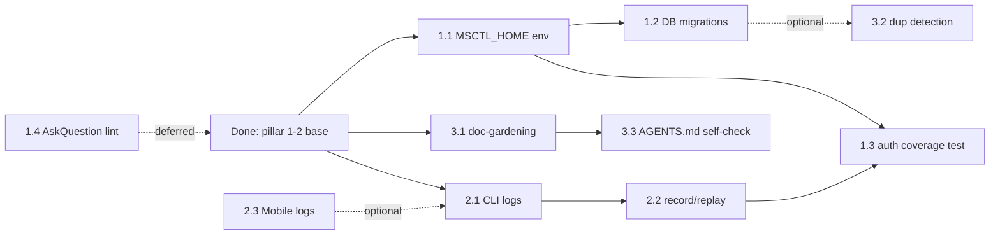

# SPEC: Harness Engineering Roadmap

> 本文是 MultiSoul Harness 工程能力的延伸建设 SPEC。已完成内容见 [`mechanized-constraints.md`](./mechanized-constraints.md)；本文描述**还没做**的事，按优先级排序，每项含 DoD（Definition of Done）与候选实现，便于未来开新分支推进。
>
> 设计原则贯穿全文：**Start Simple, Build to Delete, Mechanize Taste**。

---

## 0. 当前位置

四支柱进度回顾：

| 支柱 | 已完成 | 缺口 |
|------|--------|------|
| 1. 代码库即真相源 | AGENTS.md 地图 + docs/ 结构化目录 | 文档间双向链接、自动生成索引 |
| 2. 机械化约束 | 6 条规则 + husky + CI 双层 | 4 条软约束待机械化（见 §1） |
| 3. 反馈循环 | pre-commit (~1s) + CI (~3min) 两层 | runtime 可观测性 0（见 §2） |
| 4. 熵管理 | 0 | doc-gardening / linter-as-feedback / GC（见 §3） |

---

## 1. 待机械化的软约束（支柱 2 续）

按 ROI（拦截价值 ÷ 实现成本）排序。

### 1.1 [HIGH] 不要碰 `~/.config/msctl/*`

**起因**：用户本地数据敏感（含 token、对话历史、push token）。Agent 跑测试或脚本时若误操作 `~/.config/msctl/serve.db`，可能丢失数据或污染 token。

**软约束所在**：[`AGENTS.md`](../../AGENTS.md) §2 / [`CLAUDE.md`](../../CLAUDE.md) UI 设计系统段。

**候选实现**：

- **方案 A · 静态扫描**：grep 测试代码中是否出现 `~/.config/msctl/` 字面量，仅允许在 `cli/src/config.rs` 与 `cli/src/db.rs` 出现
  - 成本：1 个 `scripts/check-no-msctl-touch.sh`，~30 行
  - 风险：路径常被组装（`dirs::config_dir().join("msctl")`），静态扫描可能漏判
- **方案 B · 沙箱测试环境变量**：测试时强制设置 `MSCTL_HOME=/tmp/...`；生产代码读 `MSCTL_HOME or ~/.config/msctl`
  - 成本：改 `config.rs` + `db.rs` 加环境变量回退；测试 fixture 加 setup
  - 优势：从根上切断错误的可能，不依赖人扫
  - 推荐

**DoD**：
- [ ] `cli/src/config.rs` 与 `cli/src/db.rs` 路径解析读 `MSCTL_HOME` env
- [ ] CI 与本地测试设置 `MSCTL_HOME=/tmp/msctl-test-<pid>`
- [ ] 添加一条 cargo test 验证：未设置 env 时回退到 `~/.config/msctl`
- [ ] AGENTS.md 把这一条从软约束移到机械化清单

---

### 1.2 [MED] DB schema 改动必须走 migration

**起因**：当前 `cli/src/db.rs` 在启动时执行 `CREATE TABLE IF NOT EXISTS`，迁移逻辑散落。Agent 给已有表加列时容易直接改 SQL 而忘了写 migration。

**软约束所在**：[`AGENTS.md`](../../AGENTS.md) §2。

**候选实现**：

- **方案 A · 文件夹约定**：建 `cli/migrations/` 目录，用 [refinery](https://crates.io/crates/refinery) 或 [sqlx-cli](https://crates.io/crates/sqlx-cli) 管理；schema 锁文件（`schema.sql` snapshot）由 CI 强制
  - 成本：~1 天工作量
- **方案 B · 启动时 schema diff**：cargo test 中用 reference schema 与运行时 schema diff，差异即 fail
  - 成本：半天
- **方案 C · grep 拦截**：禁止在 `db.rs` 之外出现 `CREATE TABLE` / `ALTER TABLE` 字符串，且 `db.rs` 中变更必须同步更新 `cli/migrations/NNN_*.sql`
  - 成本：~30 行脚本
  - 妥协：检查的是文件配对，不是真正的 schema 一致性

**DoD**：
- [ ] 选定方案
- [ ] schema 改动可被 CI 检测；文件层规则 + （可选）运行时验证
- [ ] AGENTS.md 把这一条从软约束移到机械化清单
- [ ] 现有 `db.rs` 的 `CREATE TABLE` 段重构到首条 migration

---

### 1.3 [MED] REST/WS 强制 Bearer auth

**起因**：唯一例外是 `GET /api/v1/healthz`。新加路由时若忘记套 `bearer_auth` middleware，会暴露未授权接口。

**软约束所在**：[`AGENTS.md`](../../AGENTS.md) §2。

**候选实现**：

- **方案 A · 整合测试**：cargo test 启动一个 in-process axum，逐路由验证：未带 Bearer 时除 `/healthz` 外都应 401
  - 成本：~半天，需要 mock SQLite + 测试 harness
  - 优势：行为级验证，不被代码结构变化打破
  - 推荐
- **方案 B · 静态扫描**：grep `cli/src/serve/routes/` 中 `Router::route()` 是否被 `.route_layer(middleware::from_fn(bearer_auth))` 包裹
  - 成本：低，但脆弱（一行代码风格变化就失效）

**DoD**：
- [ ] `cli/tests/auth_coverage.rs` 跑遍所有路由验证 401 行为
- [ ] CI 跑该测试
- [ ] AGENTS.md 把这一条从软约束移到机械化清单

---

### 1.4 [LOW] AskQuestion 决策必须用工具调用

**起因**：低输入场景下，自由文本问"你想要 A 还是 B 还是 C？"对用户不友好，应当用 `AskUserQuestion` 工具。

**软约束所在**：[`CLAUDE.md`](../../CLAUDE.md) §交互约束。

**候选实现**：

- **方案 A · prompt-level 软约束**：保持现状，依赖模型遵从。文档里多写几个例子提示
  - 优势：实现简单
  - 劣势：不可机械验证
- **方案 B · LLM-as-linter**：用一个独立 LLM agent 扫描会话片段，标记"问题中包含选项数字 1/2/3 但没有调 AskUserQuestion 工具"的违规
  - 成本：高，需要 prompt + 投放 channel
  - 风险：误报多

**DoD**：
- [ ] 决策：保持软约束 OR 投入做语义 lint
- [ ] 若选 B：原型完成，误报率 < 10%

**结论**：本条很难精确机械化（需语义判断），优先级低，建议长期保留为 prompt-level 软约束，重在写好范例。

---

## 2. 反馈循环建设（支柱 3）

当前两层（pre-commit + CI）解决"代码层正确性"，但缺少**运行时反馈**。Agent 完成实现后，需要能自己跑、查日志、看效果，不依赖人手动启动应用。

### 2.1 [HIGH] CLI runtime log channel `[in progress]`

**起因**：用户报 bug "Agent 在 ask_question 后卡住了"，Agent 必须自己能 reproduce + 查日志，不能问用户拷贝。

**定稿设计**：[`docs/design-docs/2026-05-02-cli-tracing-design.md`](../design-docs/2026-05-02-cli-tracing-design.md)

**关键决策**（详见 design-doc）：
- tracing + tracing-subscriber + tracing-appender
- NDJSON 输出到 `~/.cache/msctl/serve.log.YYYY-MM-DD`，按天轮转保留 7 天
- `msctl logs` 支持 `--tail / --follow / --since / --conv / --level / --json / --grep`
- balanced 脱敏（token 屏蔽 / user_text 前 200 字符）
- 一次性替换 `cli/src/serve/**` 全部 eprintln!；保留 `commands/**` 的用户交互 println

**DoD**：
- [x] 定稿 design-doc
- [ ] `cli/src/logging.rs` init_subscriber + redact helpers
- [ ] `cli/src/commands/logs.rs` 支持 7 个参数
- [ ] 全仓 `eprintln!` 替换（serve/** 部分）
- [ ] 4 个验收场景可在 5 秒内定位问题
- [ ] `docs/runbooks/debugging.md` 落档

### 2.2 [MED] HTTP/WS 行为录制 + 重放

**起因**：手动复现协议级 bug 很慢。需要把一段会话录成 fixture，本地能重放。

**候选实现**：
- `msctl record --conv <id> > session.jsonl` 录制 WS 帧
- `msctl replay session.jsonl` 在测试 server 上重放
- 录制的 fixture 可作为 cargo test 的 input

**DoD**：
- [ ] record/replay 命令可用
- [ ] 至少 2 个录制 fixture 进入 `cli/tests/fixtures/`
- [ ] 一个测试用 fixture 验证 ask_question 流

### 2.3 [LOW] Mobile 端运行时日志通道

**起因**：手机端 bug 难以远程诊断（用户不会发 log）。

**候选实现**：
- 引入 `expo-logging` 或自写 log buffer 写到 SQLite
- App 内提供"导出最近 50 条日志"按钮，分享文本

**DoD**：
- [ ] 日志写入 SQLite ring buffer
- [ ] 设置页有"导出日志"按钮

---

## 3. 熵管理（支柱 4）

AI 生成代码的独特退化：文档漂移、风格不一致、复制粘贴堆积。当前**完全没做**，是最薄弱环节。

### 3.1 [HIGH] doc-gardening agent

**起因**：本次重构暴露：SPEC.md §"目录结构（最终）"段已落后于真实结构（仍写 `docs/SPEC.md`）。这种漂移会持续发生。

**当前 pilot**：`docs/design-docs/2026-05-03-new-cli-runtime-integration-guide.md` 已接入 Doc-Code Hash Guard（见 [`docs/design-docs/2026-05-03-doc-code-hash-guard-design.md`](../design-docs/2026-05-03-doc-code-hash-guard-design.md)），用于验证“关联代码变更必须驱动文档更新”的 blocking gate。

**候选实现**：
- 一个 `scripts/audit-docs.sh` 后台 agent，每周跑：
  - 比对 `docs/` 中提到的文件路径与真实文件存在性
  - 比对 `AGENTS.md`、`README.md` 中链接的目标是否存在
  - 列出 30 天未更新但 mtime 上代码变化的设计文档（候选 stale）
- 输出 markdown 报告到 GitHub issue 或 `docs/quality/audit-report-<date>.md`

**DoD**：
- [ ] `scripts/audit-docs.sh` 输出三类问题：dead-link / path-mismatch / stale-design-doc
- [ ] CI 周一自动跑（`schedule: cron`），结果 commit 到 `docs/quality/audits/`
- [ ] 至少修复初次报告中前 5 个问题

### 3.2 [MED] 重复代码 / 风格漂移检测

**起因**：Agent 容易在不同文件里重新实现相似工具函数（"timestamp formatter" 出现 3 次）。

**候选实现**：
- mobile 用 [jscpd](https://www.npmjs.com/package/jscpd) 跑相似度报告
- cli 用 [cargo-machete](https://crates.io/crates/cargo-machete) 查未用依赖 + clippy 严格规则
- CI 加 job 但只 warn，不阻塞 merge（避免误报阻断开发）

**DoD**：
- [ ] CI job `code-duplication-report` 输出报告制品
- [ ] 团队有意识看报告，每月清理一次

### 3.3 [LOW] AGENTS.md 自检

**起因**：AGENTS.md §4 "Where to find..." 表里指向的目录与真实存在的目录可能漂移。

**候选实现**：
- 扩展 `scripts/check-agents-md-size.sh`：解析 markdown 链接，验证目标存在
- 如果 §4 提到 `docs/quality/`，但目录被改名了，立刻 fail

**DoD**：
- [ ] 上述检查加入脚本
- [ ] 演练通过

---

## 4. 优先级与依赖

**第一波（约 3-5 天工时）**：1.1（MSCTL_HOME）+ 2.1（CLI logs）+ 3.1（doc-gardening）—— 三条都解锁后续。

**第二波（约 3 天）**：1.2、1.3、3.3。

**第三波（按需）**：2.2、2.3、3.2、1.4。

---

## 5. Bitter Lesson 自检

**每个 Harness 组件都必须可独立删除。** 如果某项变得"删了就没法工作"，说明已经过度耦合，需要重构。

定期 review 检查项：
- [ ] 每条规则 / 脚本可单独 disable，不影响主仓库构建
- [ ] CI job 失败可临时 `continue-on-error: true` 而不阻塞 release
- [ ] doc-gardening 报告纯输出制品，不会破坏代码

参考数据点：
- Manus 6 个月重构 Harness 5 次
- Vercel 删除 80% Agent 工具后效果反而更好
- LangChain 1 年内 3 次重架构

---

## 6. 不在本 SPEC 范围内的

- 中心化云后端的 Harness 化（仓库已选定零中心）
- LLM-as-linter 大规模部署（成本高、误报多，留待模型能力提升）
- 性能压测、混沌测试（属于 SRE 范畴，不在 Harness 工程定义内）
- 多租户、企业 SSO（产品 scope 之外）

---

## 7. 参考

- [Harness Engineering — OpenAI Codex 团队](https://openai.com/index/harness-engineering/)
- [文章笔记（中文）](https://jishuzhan.net/article/2046451608960172033)
- 仓库内：[`mechanized-constraints.md`](./mechanized-constraints.md)、[`AGENTS.md`](../../AGENTS.md)、[`ARCHITECTURE.md`](../../ARCHITECTURE.md)
